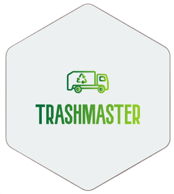
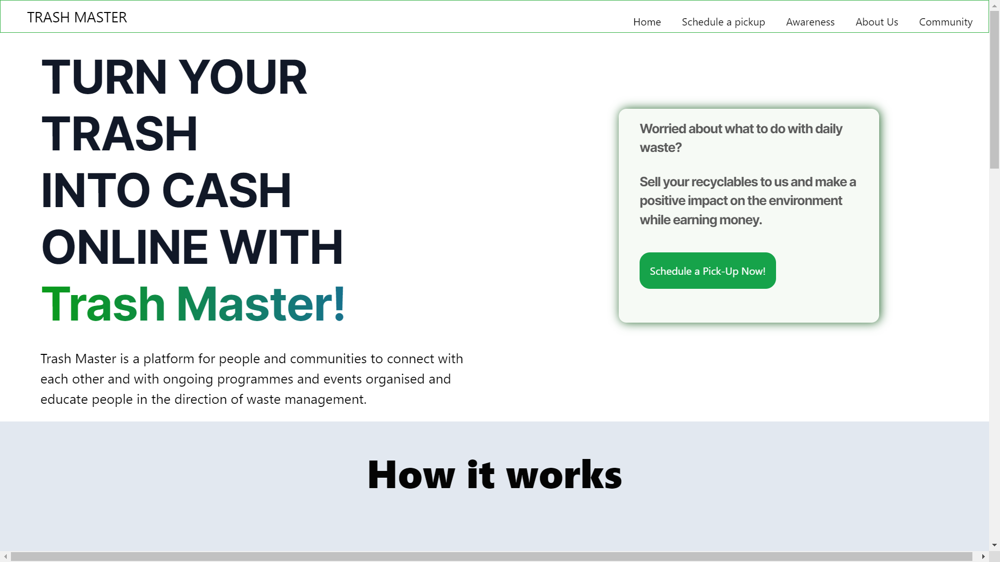
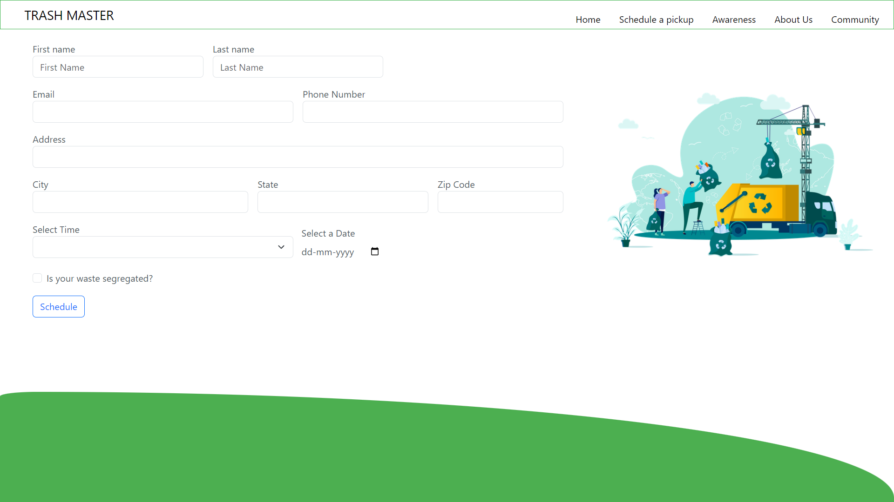

# TrashMaster



TrashMaster is a Domestic Waste Management system that allows users to schedule visits from a trash truck for waste pickup. The platform enables efficient waste disposal, with truck drivers accessing the waste, determining the payment, and ensuring proper disposal practices.

## Features



- **Scheduled Waste Pickup:** Users can schedule visits from a trash truck for convenient waste disposal.
- **Driver Interaction:** Truck drivers can access the waste during pickups and determine the appropriate payment.
- **Payment System:** A secure payment system for users to pay based on the amount of waste collected.
- **User-Friendly Interface:** Intuitive and easy-to-use interface for both users and truck drivers.

## Getting Started

To get started with TrashMaster, follow these steps:

1. **Clone the Repository:**
   ```bash
   git clone https://github.com/Vishesh-04/TrashMaster

2. Open the `index.html` file in your web browser.


## Technologies Used
- HTML
- CSS
- Javascript
- PHP
- SQL Lite

## Contributing
If you would like to contribute to TrashMaster, please follow our contribution guidelines. We welcome contributions from the community!
1. Fork the repository
2. Create a new branch: `git checkout -b feature-name`
3. Commit your changes: `git commit -m 'Add new feature'`
4. Push to the branch: `git push origin feature-name`
5. Submit a pull request

## License
This project is licensed under the MIT License.

## Contact

If you have any questions or suggestions, feel free to contact us at [LinkedIn](https://www.linkedin.com/in/vishesh-jindal/).